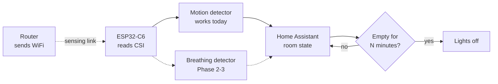
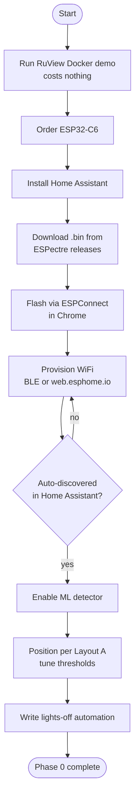

# WiFi CSI presence sensing — superseded original design

> **Historical file — do not use as the active build plan.** This first draft
> assumed an ESP32-C6 before the purchased board was identified. The active,
> hardware-locked plan is [docs/PLAN.md](../../PLAN.md) for one
> **ESP32-WROOM-32 DevKit with CH9102X USB bridge**. This file is preserved only
> as research history.

**Date:** 2026-08-17
**Owner:** Justin
**Status:** Draft — awaiting review, nothing started

---

## 1. Goal

Detect human movement and presence in a rectangular room using WiFi signals, with no
cameras and no wearables. First application: automatically turn lights off when a room
has been empty for N minutes.

**v1 scope:** movement detection in one room, driving one lighting automation.
**Explicitly out of scope for v1:** people counting, pose estimation, multi-room.

---

## 2. Why this is feasible (research findings)

Verified during design, 2026-08-17:

| Claim | Source | Note |
|---|---|---|
| Crowd counting ~86.4% for ≤5 people | DeepCount (arXiv 1903.05316) | CNN + LSTM on CSI |
| Crowd counting 92.8% for ≤10 people | WiCount | Deep learning |
| 10-shot domain adaptation, MAE 0.44 | arXiv 2601.02203 (Jan 2026) | Adapter modules; solves per-room retraining |
| Motion detection F1 > 96% | ESPectre ML detector | On-device, no calibration |
| Presence detection 82.3% | RuView v2 encoder | Retracted an earlier "100%" claim |

**Key reframe:** the lighting use case needs *binary presence*, not counting. A room with
20 people is the *easiest* case for presence — the signal is enormous. The crowd-size
limits that dominate the literature do not apply to this project.

---

## 3. Prior art and the gap

- **ESPectre** (github.com/francescopace/espectre) — 8,963 stars, actively developed,
  GPLv3. ESP32 + ESPHome + Home Assistant. This is the easy path and covers v1 entirely.
- **RuView** (github.com/ruvnet/RuView) — 89.8k stars, MIT, Rust. Far more capable
  (breathing, heart rate, counting) but a much heavier toolchain.
- **Espressif esp-csi** — official CSI toolkit.

### The open gap

ESPectre detects **motion**, not **presence**. Its docs describe a 2-state IDLE/MOTION
model. A person sitting still reads as empty — lights go off on them.

[PR #112](https://github.com/francescopace/espectre/pull/112) implemented a 0.08–0.6 Hz
breathing bandpass (cascaded Butterworth + EMA) to fix exactly this. **Not merged.**
Maintainer feedback:

1. Signal computed but never integrated into the detection pipeline
2. **No precision/recall evidence on stationary scenarios** — only signal stability tested
3. Incomplete reset paths / move semantics
4. Project requires Python (`micro-espectre`) prototyping *before* any C++ port

It went stale for ~3 months and auto-closed 2026-06-29. **The missing piece is validation
evidence, not an algorithm.** That is this project's contribution opportunity.

---

## 4. Materials

### Buy (~$10–15)

- [ ] 1× **ESP32-C6-DevKit** — $6–10. Chosen over S3 and C5 because:
      - Open bug: watchdog reset with MQTT on ESP32-S3 (espectre#147)
      - Open bug: ESP32-C5 WiFi connection issues (espectre#98)
      - C6 is tested by both ESPectre and RuView
- [ ] 1× USB cable matching the board (usually USB-C)

### Already have

- [ ] 2.4GHz WiFi router — no modification needed
- [ ] A computer to flash and host

### Do not buy

- Cognitum Seed ($140) — persistent memory / attestation, not better sensing
- A laptop WiFi card will NOT work: consumer WiFi gives RSSI only, not CSI

### Optional later

- 2nd ESP32-C6 (~$10) for layout B coverage
- 3–6× ESP32-S3 (~$54) for a full mesh

---

## 5. Software

### Path A — ESPectre (easy, no coding) ← start here

- [ ] Home Assistant running (Raspberry Pi, PC, or NAS)
- [ ] Google Chrome (required for the Web Serial API)
- Firmware: download `.bin` from ESPectre releases, flash via ESPConnect in Chrome
- WiFi setup: BLE via HA Companion app, or web.esphome.io, or captive portal
- Auto-discovers in Home Assistant over the ESPHome native API — no MQTT needed

### Path B — ESPHome CLI (needed from Phase 2)

- [ ] **Python 3.12** — NOT 3.14, which has known ESPHome issues
- [ ] ESPHome 2026.5.0+
- [ ] `examples/espectre-c6.yaml` from the repo

### Path C — RuView (optional, later)

- [ ] Rust 1.85+
- [ ] ESP-IDF toolchain (`idf.py set-target esp32c6 && idf.py build`)
- [ ] Python + esptool
- Try free first: `docker run -p 3000:3000 ruvnet/wifi-densepose:latest`

**Both ESPectre and RuView run on the same board.** Flashing is reversible — no lock-in.

---

## 6. Room layout

Sensing happens on the **link between router and ESP32**, not in a radius around the
board. Aim the link across where people actually walk.

### Layout A — one link (start here)

```
    +-----------------------------------------+
    |                                         |
    |                              +--------+ |
    |                          .-' | ESP32  | |
    |                      .-'     +--------+ |
    |                  .-'                    |
    |              .-'   <-- sensing link     |
    |          .-'                            |
    | +--------+                              |
    | | router |                              |
    | +--------+                              |
    |                                         |
    +-----------------------------------------+

    Weak spots: top-left and bottom-right corners.
```

### Layout B — two links (better coverage, +$10)

```
    +-----------------------------------------+
    |                                         |
    |                              +--------+ |
    |                          .-' | ESP32  | |
    |                      .-'     +--------+ |
    | +--------+       .-'                    |
    | | router |----->                        |
    | +--------+       '-.                    |
    |                      '-.     +--------+ |
    |                          '-. | ESP32  | |
    |                              +--------+ |
    +-----------------------------------------+

    Two links cross the room at different angles and
    cover each other's blind spots.
```

A link is blind to motion *along* it and sensitive to motion *across* it.

### System architecture



Solid lines are Phase 0 (works out of the box). Dashed lines are what this project adds.
The breathing detector fuses as an OR at the state level: motion catches someone walking
in, breathing catches someone sitting still.

### Summary

- **Layout A** — router in one corner, ESP32 in the opposite corner. One diagonal link.
  The other two corners are weakly covered. Start here.
- **Layout B** — router mid-wall, two ESP32s at the opposite corners. Two crossing links,
  roughly double the usable floor area for ~$10 more.

Constraints from ESPectre docs:
- Optimal distance 3–8 m from router
- Degrades beyond 10–15 m
- Metal and reinforced concrete reduce sensitivity

A link is blind to motion *along* it and sensitive to motion *across* it. Two links at
different angles cover each other's blind spots.

---

## 7. Phases

### Phase 0 — Baseline (one weekend)



- [ ] Run the RuView Docker demo to see what output looks like (costs nothing)
- [ ] Order ESP32-C6
- [ ] Get Home Assistant running
- [ ] Flash ESPectre via ESPConnect in Chrome
- [ ] Provision WiFi, confirm auto-discovery in Home Assistant
- [ ] Enable the ML detector (`detection_algorithm: ml`)
- [ ] Position board per Layout A, tune per `TUNING.md`
- [ ] Write automation: no motion for N minutes → lights off
- [ ] **Verify:** walk through the link, watch the movement score climb, confirm lights
      turn off after timeout

**At the end of Phase 0 the original goal is complete.** Everything after is research.

### Phase 1 — Characterize the failure (1–2 weeks)

- [ ] Build the raw CSI logger (see §8) — do this before collecting anything
- [ ] Sit still deliberately: reading, studying, watching something
- [ ] Log every false "empty" with timestamps
- [ ] Record ground truth in three classes: `empty`, `present-moving`, `present-still`
- [ ] **Deliverable:** a labeled dataset of the stationary-person failure, specific to
      this room. Nobody else has this.

### Phase 2 — Rebuild the breathing detector in Python (2–3 weeks)

- [ ] Work in `micro-espectre` — **Python only, no C++**. This rule killed PR #112.
- [ ] Implement 0.08–0.6 Hz bandpass (4.8–36 breaths/min), using PR #112 coefficients as
      reference
- [ ] Output a `breathing_score` per window
- [ ] Validate against Phase 1 recordings

### Phase 3 — Validation, the part that was actually missing (2–4 weeks)

- [ ] Measure precision and recall for stationary presence
- [ ] Compare motion-only vs motion+breathing; report the **lift**
- [ ] Evaluate **only on windows where the motion detector says idle** — that is the
      scenario slice the maintainer asked about
- [ ] Tune the threshold for asymmetric cost: a false "empty" on a still person is far
      worse than a few extra minutes of lights
- [ ] **Deliverable:** the evaluation report PR #112 never produced

### Phase 4 — Integrate and contribute

- [ ] Wire `breathing_score` into the detection pipeline as a real user-facing option,
      not just an exposed number
- [ ] Fuse as OR at the state level: motion catches walking in, breathing catches
      sitting still
- [ ] Open a Python-only PR with evaluation results attached
- [ ] Note: ESPectre is GPLv3 — derivative work inherits that license

---

## 8. The extensibility requirement

**Log raw CSI from day one, not just the motion decision.**

If only `motion: true` is stored, everything is thrown away. With timestamped raw CSI plus
labels, every future extension becomes a replay over data already collected rather than a
new collection campaign.

- [ ] Rolling capture of raw CSI frames with timestamps
- [ ] Separate ground-truth annotation log
- [ ] Store in `data/`, one file per session

### Extension ladder (each step reuses the previous step's data)

1. **Movement** — variance over CSI amplitude ← v1
2. **Presence** — add the breathing band ← the ESPectre gap
3. **Zone** — with 2+ links, compare which is disturbed to infer location
4. **Counting** — regression on aggregate statistics; ~5 reliable, ~10 with effort
5. **Activity** — classify walking / sitting / falling from temporal patterns

---

## 9. Open questions and risks

| Item | Status |
|---|---|
| Has anyone forked ESPectre to retry breathing detection? | **Unverified** — check forks and open PRs before Phase 2 |
| Does WiMANS "0 active users" mean nobody present, or present-but-idle? | **Unverified** — matters if public data is used |
| Can Home Assistant and Nexmon CSI share one Raspberry Pi? | **Unverified** — monitor mode likely conflicts; only relevant if the ESP32 path is abandoned |
| Phase 1 pace | Depends on patiently capturing failures; cannot be rushed |
| A $15 mmWave sensor solves the lighting problem outright | Accepted tradeoff — this project is for the learning and the contribution |

---

## 10. Alternatives considered and rejected

- **mmWave radar (60GHz)** — better spatial resolution, $30–100. The right answer for
  pure reliability; rejected because it doesn't use existing WiFi and isn't the project.
- **Raspberry Pi + Nexmon CSI** — richer data (80MHz, 4 streams) but firmware patching
  and 5–8× the cost. Reconsider only if the ESP32 path fails.
- **Router firmware (ASUS RT-AC86U)** — no extra device, but reflashing the household
  router is unacceptable risk.
- **Public datasets only** — no hardware needed, but no Phase 1 and no deployment.
- **Device presence on the router** — free, works today, but tracks phones not people and
  can't tell which room.

---

## 11. Sources

- ESPectre — https://github.com/francescopace/espectre
- ESPectre PR #112 (breathing) — https://github.com/francescopace/espectre/pull/112
- RuView — https://github.com/ruvnet/RuView
- Espressif esp-csi — https://github.com/espressif/esp-csi
- DeepCount — https://arxiv.org/abs/1903.05316
- Domain adaptation w/ adapters — https://arxiv.org/pdf/2601.02203
- WiMANS — https://arxiv.org/pdf/2604.16572
- Nexmon CSI — https://dl.acm.org/doi/10.1145/3349623.3355477
